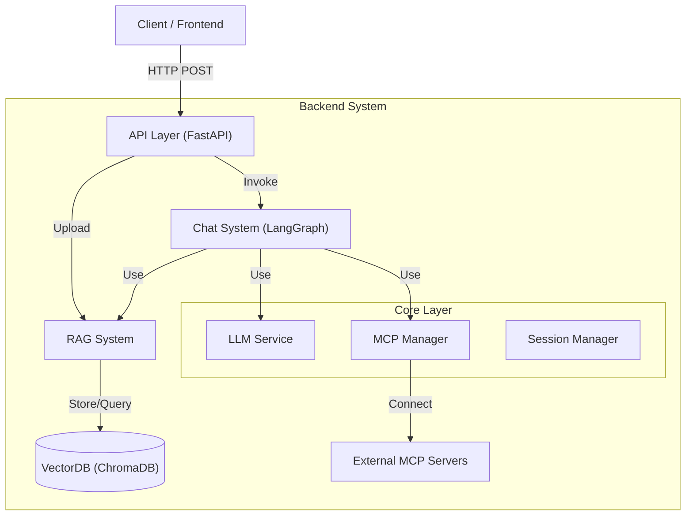
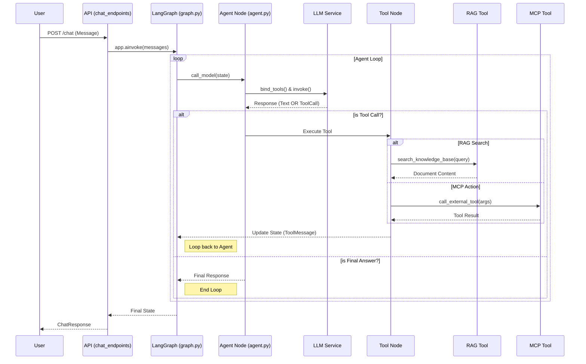
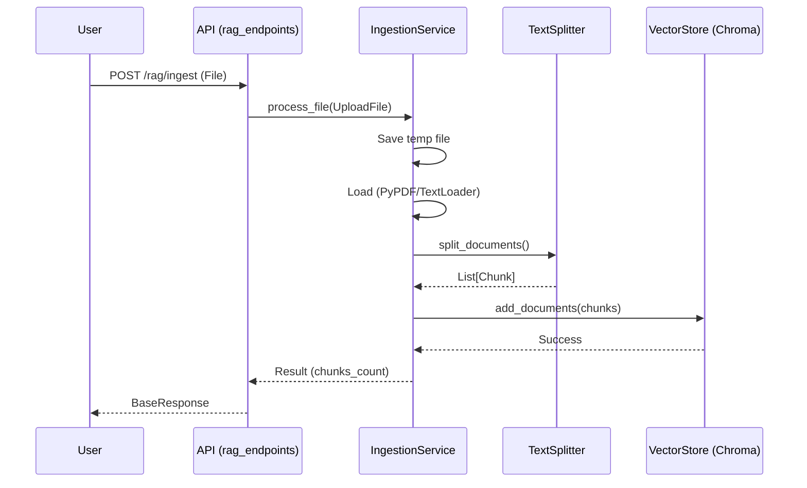

# SoundMind-AI-V2 : SM-ai-v2

**Multi-Modal AI Agent System** integrating **LLM**, **RAG**, and **MCP (Model Context Protocol)**.
This backend serves as the intelligence layer, capable of autonomous decision-making, internal knowledge retrieval, and external tool usage.

---

## 1. 🚀 실행 방법 (Getting Started)

### 필수 요구 사항
- Python 3.11+
- Node.js (for local MCP server testing)
- `uv` (Python package manager)

### 설치 및 실행

#### 1. 환경 설정
`.env` 파일을 생성하고 API Key를 입력합니다.
```ini
OPENAI_API_KEY=sk-...
CHROMA_DB_PATH=./chroma_db
MCP_SERVER_URLS=["http://localhost:8001/sse"]
```

#### 2. 의존성 설치
```bash
uv sync
```

#### 3. 서버 실행
**Backend Server (FastAPI)**
```bash
uv run uvicorn src.api.main:app --reload
```

**Test MCP Server (Optional)**
```bash
uv run uvicorn tools.mcp_server:app --port 8001
```

#### 4. API 문서 확인
브라우저에서 [http://127.0.0.1:8000/docs](http://127.0.0.1:8000/docs) 접속.

---

## 2. 🏗️ 설계 개요 및 구조 (Architecture)

이 프로젝트는 **Clean Architecture**와 **Layered Architecture** 원칙을 따릅니다.



---

## 3. 📂 폴더 및 파일 역할 (Directory Structure)

| 경로 | 역할 및 설명 |
| :--- | :--- |
| **`src/api/`** | **외부 인터페이스 계층.** HTTP 요청을 받아 비즈니스 로직으로 전달합니다. |
| `├─ main.py` | FastAPI 앱 진입점. 수명 주기(Startup/Shutdown) 관리. |
| `├─ router.py` | 모든 API 라우터를 통합 관리. |
| `├─ chat_endpoints.py` | `/chat` 엔드포인트. LangGraph 실행 요청 처리. |
| `└─ rag_endpoints.py` | `/rag/ingest` 엔드포인트. 문서 업로드 처리. |
| **`src/core/`** | **핵심 인프라 계층.** 시스템 전반에서 사용되는 공통 서비스. |
| `├─ llm_service.py` | OpenAI/Anthropic 등 LLM 클라이언트 팩토리. |
| `├─ mcp_manager.py` | 외부 MCP 서버와의 연결 및 도구 로드 관리. |
| `├─ mcp_client.py` | 실제 SSE 통신을 담당하는 MCP 클라이언트 구현체. |
| `└─ session_manager.py` | 대화 상태(State) 저장을 위한 Checkpointer 관리. |
| **`src/systems/`** | **비즈니스 로직 계층.** 구체적인 기능 구현체. |
| **`├─ chat/`** | **Agentic Chat System** |
| `│  ├─ graph.py` | LangGraph 정의 (StateGraph 구성). |
| `│  ├─ agent.py` | Agent 노드 로직 (LLM 호출 및 판단). |
| `│  └─ tools.py` | Agent가 사용할 도구(RAG + MCP) 바인딩. |
| **`└─ rag/`** | **RAG (Retrieval-Augmented Generation) System** |
| `   ├─ ingestion.py` | 문서 로드, 청킹(Splitting), 임베딩 처리. |
| `   ├─ vector_store.py` | ChromaDB 싱글톤 래퍼. |
| `   └─ tool.py` | Agent가 검색을 수행할 때 사용하는 `BaseTool` 래퍼. |

---

## 4. ⚙️ 비즈니스 로직 처리 순서 (Detailed Flows)

### A. 채팅 및 에이전트 실행 흐름 (`POST /v1/chat`)

사용자가 메시지를 보내면 **LangGraph**가 루프를 돌며 답변을 생성합니다.



**상세 함수 호출 순서:**
1.  `src.api.chat_endpoints.chat_endpoint()`: 요청 수신.
2.  `src.systems.chat.graph.get_graph()`: 컴파일된 LangGraph 앱 가져오기.
3.  `app.ainvoke()`: 그래프 실행 시작.
4.  **Node: Agent** (`src.systems.chat.agent.call_model`)
    *   `LLMService.get_llm()`: LLM 인스턴스 획득.
    *   `src.systems.chat.tools.get_all_tools()`: RAG 및 MCP 도구 목록 로드.
    *   `llm.bind_tools(tools)`: 도구 바인딩.
    *   `llm.ainvoke()`: LLM에게 질문 전달.
5.  **Edge: Conditional** (`should_continue`)
    *   LLM 응답에 `tool_calls`가 있으면 -> `tools` 노드로 이동.
    *   없으면 -> `END`로 이동.
6.  **Node: Tools** (`ToolNode`)
    *   `tool_calls`에 명시된 도구 실행 (예: `RAGTool._run` 또는 `MCPClient.session.call_tool`).
    *   결과를 `ToolMessage`로 상태에 추가.
7.  **Loop**: 다시 **Agent** 노드로 돌아가서 도구 결과를 바탕으로 최종 답변 생성.

---

### B. RAG 문서 업로드 흐름 (`POST /v1/rag/ingest`)

문서를 업로드하여 벡터 DB에 저장하는 과정입니다.



**상세 함수 호출 순서:**
1.  `src.api.rag_endpoints.ingest_document()`: 파일 수신.
2.  `src.systems.rag.ingestion.IngestionService.process_file()`: 메인 로직 실행.
3.  `_load_file()`: 파일 확장자에 따라 `PyPDFLoader` 또는 `TextLoader` 선택 후 로드.
4.  `RecursiveCharacterTextSplitter.split_documents()`: 긴 텍스트를 청크 단위로 분할.
5.  `src.systems.rag.vector_store.VectorStore.add_documents()`:
    *   `OpenAIEmbeddings`: 텍스트를 벡터로 변환.
    *   `Chroma.add_documents()`: 벡터 DB에 저장 및 인덱싱.
