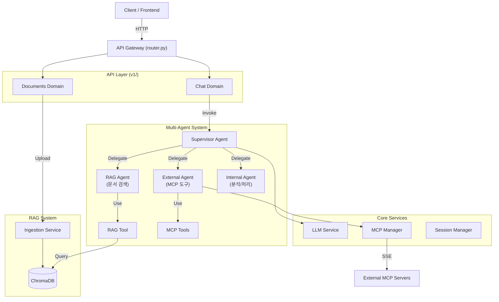
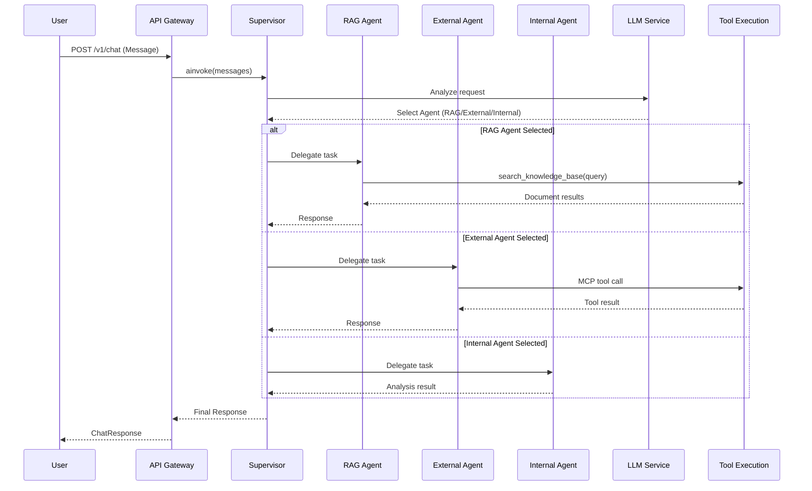
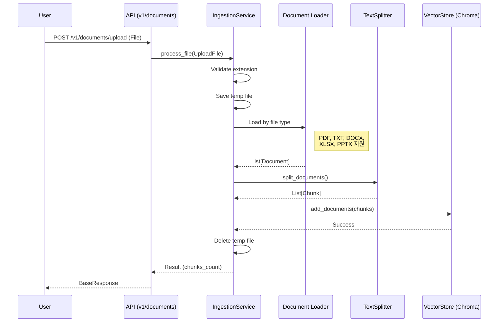

# SoundMind-AI-V2 : SM-ai-v2

**Multi-Agent AI System** integrating **LLM**, **RAG**, and **MCP (Model Context Protocol)**.
This backend serves as the intelligence layer with a **Supervisor-based Multi-Agent architecture**, capable of autonomous decision-making, internal knowledge retrieval, and external tool usage.

---

## 1. 🚀 실행 방법 (Getting Started)

### 필수 요구 사항
- Python 3.11+
- Node.js (for local MCP server testing)
- `uv` (Python package manager)

### 설치 및 실행

#### 1. 환경 설정
`.env` 파일을 생성하고 API Key를 입력합니다.
```ini
OPENAI_API_KEY=sk-...
CHROMA_DB_PATH=./chroma_db
MCP_SERVER_URLS=["http://localhost:8001/sse"]
```

#### 2. 의존성 설치
```bash
uv sync
```

#### 3. 서버 실행
**Backend Server (FastAPI)**
```bash
uv run uvicorn src.api.main:app --reload
```

**Test MCP Server (Optional)**
```bash
uv run python mcp_tools/mcp_server.py
```

#### 4. API 문서 확인
브라우저에서 [http://127.0.0.1:8000/docs](http://127.0.0.1:8000/docs) 접속.

---

## 2. 🏗️ 설계 개요 및 구조 (Architecture)

이 프로젝트는 **Clean Architecture**와 **Multi-Agent Supervisor 패턴**을 따릅니다.



### Multi-Agent 구조

| Agent | 역할 | 도구 |
|-------|------|------|
| **Supervisor** | 사용자 요청 분석 및 적절한 Agent에 위임 | - |
| **RAG Agent** | 내부 문서/지식 검색 | `search_knowledge_base` |
| **External Agent** | 외부 시스템 연동 (MCP) | MCP Tools (동적 로드) |
| **Internal Agent** | 데이터 분석 및 처리 | 향후 확장 예정 |

---

## 3. 📂 폴더 및 파일 역할 (Directory Structure)

### API Layer (`src/api/`)

| 경로 | 역할 및 설명 |
| :--- | :--- |
| **`src/api/`** | **API Gateway 계층.** HTTP 요청을 받아 비즈니스 로직으로 전달합니다. |
| `├─ main.py` | FastAPI 앱 진입점. 수명 주기(Startup/Shutdown) 관리. |
| `├─ router.py` | **API Gateway.** 도메인별 라우터 통합 및 라우팅. |
| `├─ dependencies.py` | 공통 의존성 (그래프 캐시, 인증 등). |
| `└─ v1/` | **API v1 도메인** |
| `   ├─ chat.py` | `/v1/chat` - Multi-Agent 채팅 엔드포인트. |
| `   └─ documents.py` | `/v1/documents/upload` - 문서 업로드 엔드포인트. |

### Core Layer (`src/core/`)

| 경로 | 역할 및 설명 |
| :--- | :--- |
| **`src/core/`** | **핵심 인프라 계층.** 시스템 전반에서 사용되는 공통 서비스. |
| `├─ llm_service.py` | OpenAI/Anthropic 등 LLM 클라이언트 팩토리. |
| `├─ mcp_manager.py` | 외부 MCP 서버와의 연결 및 도구 로드 관리. |
| `├─ mcp_client.py` | 실제 SSE 통신을 담당하는 MCP 클라이언트 구현체. |
| `└─ session_manager.py` | 대화 상태(State) 저장을 위한 Checkpointer 관리. |

### Systems Layer (`src/systems/`)

| 경로 | 역할 및 설명 |
| :--- | :--- |
| **`src/systems/`** | **비즈니스 로직 계층.** 구체적인 기능 구현체. |
| `├─ build_graph.py` | **Multi-Agent Supervisor 그래프 빌더.** |
| `├─ calling_tools.py` | Agent별 도구 관리 (RAG/External/Internal). |
| **`├─ agent/`** | **Multi-Agent 정의** |
| `│  ├─ supervisor.py` | Supervisor 프롬프트 및 라우팅 규칙. |
| `│  ├─ rag_agent.py` | RAG Agent (문서 검색 전문). |
| `│  ├─ external_agent.py` | External Agent (MCP 도구 전문). |
| `│  └─ internal_agent.py` | Internal Agent (분석/처리 전문). |
| **`└─ rag/`** | **RAG System** |
| `   ├─ ingestion.py` | 문서 로드, 청킹, 임베딩 처리. |
| `   ├─ vector_store.py` | ChromaDB 싱글톤 래퍼. |
| `   ├─ rag_tool.py` | Agent가 검색할 때 사용하는 `BaseTool` 래퍼. |
| `   ├─ exceptions.py` | RAG 관련 커스텀 예외. |
| `   └─ loaders/` | 문서 로더 (Excel, PowerPoint). |

---

## 4. ⚙️ 비즈니스 로직 처리 순서 (Detailed Flows)

### A. 채팅 및 에이전트 실행 흐름 (`POST /v1/chat`)

사용자가 메시지를 보내면 **Supervisor**가 요청을 분석하고 적절한 **전문 Agent**에게 작업을 위임합니다.



**상세 함수 호출 순서:**
1.  `src.api.v1.chat.send_message()`: 요청 수신.
2.  `src.api.dependencies.get_graph()`: 캐시된 Multi-Agent 그래프 획득.
3.  `graph.ainvoke()`: Supervisor 그래프 실행.
4.  **Supervisor Agent** (`langgraph_supervisor`)
    *   사용자 요청 분석.
    *   적절한 전문 Agent 선택 (RAG/External/Internal).
5.  **Selected Agent** (`create_react_agent`)
    *   `LLMService.get_llm()`: LLM 인스턴스 획득.
    *   도구 바인딩 및 실행.
    *   결과를 Supervisor에게 반환.
6.  **Supervisor**: 최종 응답 생성 또는 다른 Agent에게 추가 위임.

---

### B. 문서 업로드 흐름 (`POST /v1/documents/upload`)

문서를 업로드하여 벡터 DB에 저장하는 과정입니다.



**지원 파일 형식:**

| 확장자 | 로더 | 출력 형식 |
|--------|------|-----------|
| `.pdf` | PyPDFLoader | 페이지별 Document |
| `.txt` | TextLoader | UTF-8 텍스트 |
| `.docx` | Docx2txtLoader | 텍스트 추출 |
| `.xlsx` | ExcelLoader (커스텀) | 마크다운 테이블, 시트별 Document |
| `.pptx` | PowerPointLoader (커스텀) | 슬라이드별 Document |

**상세 함수 호출 순서:**
1.  `src.api.v1.documents.upload_document()`: 파일 수신.
2.  `src.systems.rag.ingestion.IngestionService.process_file()`: 메인 로직 실행.
3.  파일 확장자 검증 (`SUPPORTED_EXTENSIONS`).
4.  `_load_file()`: 확장자에 따라 적절한 로더 선택.
    *   PDF: `PyPDFLoader`
    *   TXT: `TextLoader`
    *   DOCX: `Docx2txtLoader`
    *   XLSX: `ExcelLoader` (마크다운 테이블 형식)
    *   PPTX: `PowerPointLoader` (슬라이드별 분리)
5.  `RecursiveCharacterTextSplitter.split_documents()`: 청크 단위로 분할 (500자, 100자 오버랩).
6.  `VectorStore.add_documents()`: ChromaDB에 저장.

---

## 5. 📡 API 엔드포인트 (Endpoints)

| Method | Path | Description | Request | Response |
|--------|------|-------------|---------|----------|
| `GET` | `/health` | 서버 상태 확인 | - | `{"status": "ok"}` |
| `POST` | `/v1/chat` | Multi-Agent 채팅 | `ChatRequest` | `ChatResponse` |
| `POST` | `/v1/documents/upload` | 문서 업로드 | `File (multipart)` | `BaseResponse` |

### Request/Response 스키마

```python
# ChatRequest
{
    "message": "질문 내용",
    "session_id": "user-session-123",
    "model_name": "gpt-4-turbo-preview"  # optional
}

# ChatResponse
{
    "response": "AI 응답",
    "tool_calls": [],
    "metadata": {"thread_id": "user-session-123"}
}

# BaseResponse
{
    "success": true,
    "message": "Successfully uploaded document.pdf",
    "data": {"chunks_created": 42}
}
```

---

## 6. 🔧 기술 스택 (Tech Stack)

| Category | Technology |
|----------|------------|
| **Framework** | FastAPI |
| **Agent Framework** | LangGraph, langgraph-supervisor |
| **LLM** | OpenAI (GPT-4), Anthropic (Claude) |
| **Vector Store** | ChromaDB |
| **Embeddings** | OpenAI text-embedding-3-small |
| **External Tools** | MCP (Model Context Protocol) |
| **Document Loaders** | pypdf, docx2txt, openpyxl, python-pptx |
