# SoundMind-AI-V2: SM-AI-v2

**Supervisor-based Multi-Agent AI System** integrating **LLM**, **RAG**, and **MCP (Model Context Protocol)**.
This backend serves as the intelligence layer with a **Supervisor-based Multi-Agent architecture**, capable of autonomous decision-making, internal knowledge retrieval, and external tool usage.

---

## 1. 🚀 실행 방법 (Getting Started)

### 필수 요구 사항
- Python 3.11+
- Node.js (for local MCP server testing)
- `uv` (Python package manager)

### 설치 및 실행

#### 1. 환경 설정
`.env` 파일을 생성하고 API Key를 입력합니다.
```ini
OPENAI_API_KEY=sk-...
CHROMA_DB_PATH=./chroma_db
MCP_SERVER_URLS=["http://localhost:8001/sse"]
```

#### 2. 의존성 설치
```bash
uv sync
```

#### 3. 서버 실행
**Backend Server (FastAPI)**
```bash
uv run uvicorn src.api.main:app --reload
```

**Test MCP Server (Optional)**
```bash
uv run python mcp_tools/mcp_server.py
```

#### 4. API 문서 확인
브라우저에서 [http://127.0.0.1:8000/docs](http://127.0.0.1:8000/docs) 접속.

---

## 2. 🏗️ 설계 개요 및 구조 (Architecture)

이 프로젝트는 **Clean Architecture**와 **Multi-Agent Supervisor 패턴**을 따릅니다.

```mermaid
graph TD
    Client["Client / Frontend"] -->|HTTP| API["API Gateway (router.py)"]

    subgraph "API Layer (v1/)"
        ChatAPI["Chat Domain"]
        DocsAPI["Documents Domain"]
    end

    API --> ChatAPI
    API --> DocsAPI

    subgraph "Multi-Agent System"
        ChatAPI -->|Invoke| Supervisor["Supervisor Agent"]

        Supervisor -->|Delegate| RAGAgent["RAG Agent<br/>(문서 검색)"]
        Supervisor -->|Delegate| ExtAgent["External Agent<br/>(MCP 도구)"]
        Supervisor -->|Delegate| IntAgent["Internal Agent<br/>(분석/처리)"]

        RAGAgent -->|Use| RAGTool["RAG Tool"]
        ExtAgent -->|Use| MCPTools["MCP Tools"]
    end

    subgraph "Core Services"
        LLM["LLM Service"]
        MCP["MCP Manager"]
        Session["Session Manager"]
    end

    subgraph "RAG System"
        DocsAPI -->|Upload| Ingestion["Ingestion Service"]
        Ingestion --> VectorDB[("ChromaDB")]
        RAGTool -->|Query| VectorDB
    end

    Supervisor --> LLM
    ExtAgent --> MCP
    MCP -->|SSE| ExternalMCP["External MCP Servers"]
```



### Multi-Agent 구조

| Agent | 역할 | 도구 |
|-------|------|------|
| **Supervisor** | 사용자 요청 분석 및 적절한 Agent에 위임 | - |
| **RAG Agent** | 내부 문서/지식 검색 | `search_knowledge_base` |
| **External Agent** | 외부 시스템 연동 (MCP) | MCP Tools (동적 로드) |
| **Internal Agent** | 데이터 분석 및 처리 | 향후 확장 예정 |

---

## 3. 📂 폴더 및 파일 역할 (Directory Structure)

### API Layer (`src/api/`)

| 경로 | 역할 및 설명 |
| :--- | :--- |
| **`src/api/`** | **API Gateway 계층.** HTTP 요청을 받아 비즈니스 로직으로 전달합니다. |
| `├─ main.py` | FastAPI 앱 진입점. 수명 주기(Startup/Shutdown) 관리. |
| `├─ router.py` | **API Gateway.** 도메인별 라우터 통합 및 라우팅. |
| `├─ dependencies.py` | 공통 의존성 (그래프 캐시, 인증 등). |
| `└─ v1/` | **API v1 도메인** |
| `   ├─ chat.py` | `/v1/chat` - Multi-Agent 채팅 엔드포인트. |
| `   └─ documents.py` | `/v1/documents/upload` - 문서 업로드 엔드포인트. |

### Core Layer (`src/core/`)

| 경로 | 역할 및 설명 |
| :--- | :--- |
| **`src/core/`** | **핵심 인프라 계층.** 시스템 전반에서 사용되는 공통 서비스. |
| `├─ llm_service.py` | OpenAI/Anthropic 등 LLM 클라이언트 팩토리. |
| `├─ mcp_manager.py` | 외부 MCP 서버와의 연결 및 도구 로드 관리. |
| `├─ mcp_client.py` | 실제 SSE 통신을 담당하는 MCP 클라이언트 구현체. |
| `└─ session_manager.py` | 대화 상태(State) 저장을 위한 Checkpointer 관리. |

### Systems Layer (`src/systems/`)

| 경로 | 역할 및 설명 |
| :--- | :--- |
| **`src/systems/`** | **비즈니스 로직 계층.** 구체적인 기능 구현체. |
| `├─ build_graph.py` | **Multi-Agent Supervisor 그래프 빌더.** |
| `├─ calling_tools.py` | Agent별 도구 관리 (RAG/External/Internal). |
| **`├─ agent/`** | **Multi-Agent 정의** |
| `│  ├─ supervisor.py` | Supervisor 프롬프트 및 라우팅 규칙. |
| `│  ├─ rag_agent.py` | RAG Agent (문서 검색 전문). |
| `│  ├─ external_agent.py` | External Agent (MCP 도구 전문). |
| `│  └─ internal_agent.py` | Internal Agent (분석/처리 전문). |
| **`└─ rag/`** | **RAG System** |
| `   ├─ ingestion.py` | 문서 로드, 청킹, 임베딩 처리. |
| `   ├─ vector_store.py` | ChromaDB 싱글톤 래퍼. |
| `   ├─ rag_tool.py` | Agent가 검색할 때 사용하는 `BaseTool` 래퍼. |
| `   ├─ exceptions.py` | RAG 관련 커스텀 예외. |
| `   └─ loaders/` | 문서 로더 (Excel, PowerPoint). |

---

## 4. ⚙️ 비즈니스 로직 처리 순서 (Detailed Flows)

### A. 채팅 및 에이전트 실행 흐름 (`POST /v1/chat`)

사용자가 메시지를 보내면 **Supervisor**가 요청을 분석하고 적절한 **전문 Agent**에게 작업을 위임합니다.


**상세 함수 호출 순서:**
1.  `src.api.v1.chat.send_message()`: 요청 수신.
2.  `src.api.dependencies.get_graph()`: 캐시된 Multi-Agent 그래프 획득.
3.  `graph.ainvoke()`: Supervisor 그래프 실행.
4.  **Supervisor Agent** (`langgraph_supervisor`)
    *   사용자 요청 분석.
    *   적절한 전문 Agent 선택 (RAG/External/Internal).
5.  **Selected Agent** (`create_react_agent`)
    *   `LLMService.get_llm()`: LLM 인스턴스 획득.
    *   도구 바인딩 및 실행.
    *   결과를 Supervisor에게 반환.
6.  **Supervisor**: 최종 응답 생성 또는 다른 Agent에게 추가 위임.

---

### B. 문서 업로드 흐름 (`POST /v1/documents/upload`)

문서를 업로드하여 벡터 DB에 저장하는 과정입니다.

```mermaid
sequenceDiagram
    participant User
    participant API as API (v1/documents)
    participant Service as IngestionService
    participant Loader as Document Loader
    participant Splitter as TextSplitter
    participant VectorDB as VectorStore (Chroma)

    User->>API: POST /v1/documents/upload (File)
    API->>Service: process_file(UploadFile)
    Service->>Service: Validate extension
    Service->>Service: Save temp file
    Service->>Loader: Load by file type
    Note right of Loader: PDF, TXT, DOCX,<br/>XLSX, PPTX 지원
    Loader-->>Service: List[Document]
    Service->>Splitter: split_documents()
    Splitter-->>Service: List[Chunk]
    Service->>VectorDB: add_documents(chunks)
    VectorDB-->>Service: Success
    Service->>Service: Delete temp file
    Service-->>API: Result (chunks_count)
    API-->>User: BaseResponse
```



**지원 파일 형식:**

| 확장자 | 로더 | 출력 형식 |
|--------|------|-----------|
| `.pdf` | PyPDFLoader | 페이지별 Document |
| `.txt` | TextLoader | UTF-8 텍스트 |
| `.docx` | Docx2txtLoader | 텍스트 추출 |
| `.xlsx` | ExcelLoader (커스텀) | 마크다운 테이블, 시트별 Document |
| `.pptx` | PowerPointLoader (커스텀) | 슬라이드별 Document |

**상세 함수 호출 순서:**
1.  `src.api.v1.documents.upload_document()`: 파일 수신.
2.  `src.systems.rag.ingestion.IngestionService.process_file()`: 메인 로직 실행.
3.  파일 확장자 검증 (`SUPPORTED_EXTENSIONS`).
4.  `_load_file()`: 확장자에 따라 적절한 로더 선택.
    *   PDF: `PyPDFLoader`
    *   TXT: `TextLoader`
    *   DOCX: `Docx2txtLoader`
    *   XLSX: `ExcelLoader` (마크다운 테이블 형식)
    *   PPTX: `PowerPointLoader` (슬라이드별 분리)
5.  `RecursiveCharacterTextSplitter.split_documents()`: 청크 단위로 분할 (500자, 100자 오버랩).
6.  `VectorStore.add_documents()`: ChromaDB에 저장.

---

## 5. 📡 API 엔드포인트 (Endpoints)

| Method | Path | Description | Request | Response |
|--------|------|-------------|---------|----------|
| `GET` | `/health` | 서버 상태 확인 | - | `{"status": "ok"}` |
| `POST` | `/v1/chat` | Multi-Agent 채팅 | `ChatRequest` | `ChatResponse` |
| `POST` | `/v1/documents/upload` | 문서 업로드 | `File (multipart)` | `BaseResponse` |

### Request/Response 스키마

```python
# ChatRequest
{
    "message": "질문 내용",
    "session_id": "user-session-123",
    "model_name": "gpt-4-turbo-preview"  # optional
}

# ChatResponse
{
    "response": "AI 응답",
    "tool_calls": [],
    "metadata": {"thread_id": "user-session-123"}
}

# BaseResponse
{
    "success": true,
    "message": "Successfully uploaded document.pdf",
    "data": {"chunks_created": 42}
}
```

---

## 6. 🔧 기술 스택 (Tech Stack)

| Category | Technology |
|----------|------------|
| **Framework** | FastAPI |
| **Agent Framework** | LangGraph, langgraph-supervisor |
| **LLM** | vLLM (gpt-oss-120b), OpenAI (GPT-4), Anthropic (Claude) |
| **Vector Store** | ChromaDB |
| **Embeddings** | OpenAI text-embedding-3-small |
| **External Tools** | MCP (Model Context Protocol) |
| **Document Loaders** | pypdf, docx2txt, openpyxl, python-pptx |

---

## 7. 🖥️ vLLM 서버 설정 (vLLM Server Configuration)

### Native Tool Calling 설정

vLLM의 **Native Tool Calling** 기능을 활성화하여 LangGraph의 `create_react_agent`와 통합합니다.

#### 실행 명령어

```bash
# vllm-env 가상환경 활성화 후 실행
conda activate vllm-env

python -m vllm.entrypoints.openai.api_server \
    --model /mnt/data1/work/model_vllm/gpt_model \
    --tokenizer /mnt/data1/work/model_vllm/gpt_model \
    --served-model-name gpt-oss-120b \
    --tensor-parallel-size 2 \
    --gpu-memory-utilization 0.90 \
    --max-model-len 131072 \
    --max-num-batched-tokens 4096 \
    --port 8000 \
    --host 0.0.0.0 \
    --disable-custom-all-reduce \
    --enable-auto-tool-choice \
    --tool-call-parser openai
```

#### 주요 옵션 설명

| 옵션 | 설명 |
|------|------|
| `--enable-auto-tool-choice` | **Tool Calling 자동 활성화.** 모델이 도구 호출 여부를 자동으로 판단 |
| `--tool-call-parser openai` | **OpenAI 호환 파서.** `tool_calls` 형식으로 응답 파싱 |
| `--tensor-parallel-size 2` | 2개 GPU에서 텐서 병렬 처리 |
| `--gpu-memory-utilization 0.90` | GPU 메모리 90% 사용 |
| `--max-model-len 131072` | 최대 컨텍스트 길이 128K |

#### Tool Calling 응답 예시

```json
{
  "choices": [{
    "message": {
      "role": "assistant",
      "tool_calls": [{
        "id": "chatcmpl-tool-xxx",
        "type": "function",
        "function": {
          "name": "search_knowledge_base",
          "arguments": "{\"query\": \"보안 정책\"}"
        }
      }]
    }
  }]
}
```

---

## 8. 🏛️ Multi-Agent 아키텍처 상세 (Detailed Architecture)

### 전체 시스템 구조

```
┌─────────────────────────────────────────────────────────────────────────┐
│                           Client / Frontend                              │
└─────────────────────────────────┬───────────────────────────────────────┘
                                  │ HTTP Request
                                  ▼
┌─────────────────────────────────────────────────────────────────────────┐
│                        API Gateway (FastAPI)                             │
│  ┌─────────────────────────────────────────────────────────────────┐   │
│  │  router.py → v1/chat.py → dependencies.get_graph()               │   │
│  └─────────────────────────────────────────────────────────────────┘   │
└─────────────────────────────────┬───────────────────────────────────────┘
                                  │ graph.ainvoke()
                                  ▼
┌─────────────────────────────────────────────────────────────────────────┐
│                    Multi-Agent System (LangGraph)                        │
│                                                                          │
│  ┌───────────────────────────────────────────────────────────────────┐  │
│  │                    Supervisor Agent                                │  │
│  │              (langgraph_supervisor.create_supervisor)              │  │
│  │                                                                    │  │
│  │   ┌─────────────────────────────────────────────────────────────┐ │  │
│  │   │                    SUPERVISOR_PROMPT                         │ │  │
│  │   │  - 사용자 요청 분석                                          │ │  │
│  │   │  - 적절한 Agent 선택 (rag/external/internal)                 │ │  │
│  │   │  - 작업 위임 및 결과 조율                                    │ │  │
│  │   └─────────────────────────────────────────────────────────────┘ │  │
│  └───────────────────────────────┬───────────────────────────────────┘  │
│                                  │ Delegate                              │
│          ┌───────────────────────┼───────────────────────┐              │
│          ▼                       ▼                       ▼              │
│  ┌──────────────────┐   ┌──────────────────┐   ┌──────────────────┐    │
│  │   RAG Agent      │   │  External Agent  │   │  Internal Agent  │    │
│  │ (rag_agent.py)   │   │(external_agent.py)│   │(internal_agent.py)│   │
│  │                  │   │                  │   │                  │    │
│  │ create_react_    │   │ create_react_    │   │ create_react_    │    │
│  │ agent()          │   │ agent()          │   │ agent()          │    │
│  │                  │   │                  │   │                  │    │
│  │ ┌──────────────┐ │   │ ┌──────────────┐ │   │ ┌──────────────┐ │    │
│  │ │ RAG_AGENT_   │ │   │ │ EXTERNAL_    │ │   │ │ INTERNAL_    │ │    │
│  │ │ PROMPT       │ │   │ │ AGENT_PROMPT │ │   │ │ AGENT_PROMPT │ │    │
│  │ └──────────────┘ │   │ └──────────────┘ │   │ └──────────────┘ │    │
│  └────────┬─────────┘   └────────┬─────────┘   └────────┬─────────┘    │
│           │                      │                      │              │
│           ▼                      ▼                      ▼              │
│  ┌──────────────────┐   ┌──────────────────┐   ┌──────────────────┐    │
│  │ search_knowledge │   │   MCP Tools      │   │  (Future Tools)  │    │
│  │ _base            │   │ (Dynamic Load)   │   │                  │    │
│  └────────┬─────────┘   └────────┬─────────┘   └──────────────────┘    │
│           │                      │                                      │
└───────────┼──────────────────────┼──────────────────────────────────────┘
            │                      │
            ▼                      ▼
┌───────────────────────┐  ┌───────────────────────┐
│   ChromaDB            │  │   MCP Servers         │
│   (Vector Store)      │  │   (SSE Connection)    │
│                       │  │                       │
│   - RAG 검색          │  │   - 파일 시스템       │
│   - 문서 임베딩       │  │   - 외부 API 연동     │
└───────────────────────┘  └───────────────────────┘
```

### Tool Calling 흐름도

```
┌──────────────────────────────────────────────────────────────────────────┐
│                     Native Tool Calling Flow                              │
└──────────────────────────────────────────────────────────────────────────┘

User Query: "회사 보안 정책을 검색해줘"
     │
     ▼
┌─────────────────────────────────────────────────────────────────────────┐
│ Supervisor Agent                                                         │
│                                                                          │
│  Input: "회사 보안 정책을 검색해줘"                                      │
│         ↓                                                                │
│  Analysis: 키워드 "검색", "정책" → rag_agent 선택                        │
│         ↓                                                                │
│  Output: Handoff to rag_agent                                            │
└─────────────────────────────────────────────────────────────────────────┘
     │
     ▼
┌─────────────────────────────────────────────────────────────────────────┐
│ RAG Agent (create_react_agent)                                           │
│                                                                          │
│  ┌────────────────────────────────────────────────────────────────────┐ │
│  │ Step 1: LLM decides to call tool                                   │ │
│  │                                                                     │ │
│  │ vLLM Response (--enable-auto-tool-choice):                         │ │
│  │ {                                                                   │ │
│  │   "tool_calls": [{                                                  │ │
│  │     "function": {                                                   │ │
│  │       "name": "search_knowledge_base",                              │ │
│  │       "arguments": "{\"query\": \"회사 보안 정책\"}"                │ │
│  │     }                                                               │ │
│  │   }]                                                                │ │
│  │ }                                                                   │ │
│  └────────────────────────────────────────────────────────────────────┘ │
│                              │                                           │
│                              ▼                                           │
│  ┌────────────────────────────────────────────────────────────────────┐ │
│  │ Step 2: Tool Execution                                             │ │
│  │                                                                     │ │
│  │ search_knowledge_base(query="회사 보안 정책")                       │ │
│  │     ↓                                                               │ │
│  │ ChromaDB.similarity_search(query, k=5)                              │ │
│  │     ↓                                                               │ │
│  │ Return: [Document1, Document2, ...]                                 │ │
│  └────────────────────────────────────────────────────────────────────┘ │
│                              │                                           │
│                              ▼                                           │
│  ┌────────────────────────────────────────────────────────────────────┐ │
│  │ Step 3: LLM generates final response                               │ │
│  │                                                                     │ │
│  │ "검색 결과, 회사 보안 정책은 다음과 같습니다: ..."                  │ │
│  └────────────────────────────────────────────────────────────────────┘ │
└─────────────────────────────────────────────────────────────────────────┘
     │
     ▼
┌─────────────────────────────────────────────────────────────────────────┐
│ Response to User                                                         │
│                                                                          │
│ "검색 결과, 회사 보안 정책은 다음과 같습니다:                           │
│  1. 비밀번호는 최소 12자 이상...                                        │
│  2. 2단계 인증 필수..."                                                 │
└─────────────────────────────────────────────────────────────────────────┘
```

### MCP Tool Schema 변환 흐름

```
┌──────────────────────────────────────────────────────────────────────────┐
│              MCP JSON Schema → Pydantic Model 변환                        │
└──────────────────────────────────────────────────────────────────────────┘

MCP Tool Definition (JSON Schema)
─────────────────────────────────
{
  "name": "list_directory",
  "description": "List files in directory",
  "inputSchema": {
    "type": "object",
    "properties": {
      "path": {
        "type": "string",
        "description": "Directory path"
      },
      "recursive": {
        "type": "boolean",
        "description": "Include subdirectories"
      }
    },
    "required": ["path"]
  }
}
         │
         │  json_schema_to_pydantic()
         │  (src/core/mcp_client.py:11)
         ▼
Pydantic Model (Dynamic)
────────────────────────
class list_directoryInput(BaseModel):
    path: str = Field(..., description="Directory path")
    recursive: Optional[bool] = Field(None, description="Include subdirectories")
         │
         │  StructuredTool.from_function(args_schema=...)
         ▼
LangChain StructuredTool
────────────────────────
StructuredTool(
    name="list_directory",
    description="List files in directory",
    args_schema=list_directoryInput,  # ← Pydantic 모델
    coroutine=tool_wrapper
)
         │
         │  bind_tools() by LangGraph
         ▼
vLLM Tool Definition (OpenAI Format)
────────────────────────────────────
{
  "type": "function",
  "function": {
    "name": "list_directory",
    "description": "List files in directory",
    "parameters": {
      "type": "object",
      "properties": {
        "path": {"type": "string", "description": "Directory path"},
        "recursive": {"type": "boolean", "description": "Include subdirectories"}
      },
      "required": ["path"]
    }
  }
}
```

---

## 9. 📝 리팩토링 변경 사항 (Refactoring Changes)

### 2024-11-26 리팩토링 내용

#### 삭제된 파일 (Removed)

| 파일 | 설명 |
|------|------|
| `src/systems/react/` | **전체 폴더 삭제.** 커스텀 프롬프트 기반 ReAct 구현 제거 |
| `├─ __init__.py` | 패키지 초기화 |
| `├─ state.py` | 커스텀 상태 정의 |
| `├─ tool_parser.py` | 프롬프트 기반 도구 파싱 (`Action:`, `Action Input:`) |
| `├─ nodes.py` | 그래프 노드 정의 |
| `├─ agent_builder.py` | 커스텀 ReAct 에이전트 빌더 |
| `└─ supervisor.py` | 커스텀 Supervisor 구현 |

#### 변경된 파일 (Modified)

| 파일 | 변경 내용 |
|------|----------|
| `src/systems/build_graph.py` | `langgraph_supervisor.create_supervisor` 사용으로 변경 |
| `src/systems/agent/rag_agent.py` | `langgraph.prebuilt.create_react_agent` 사용, 프롬프트 간소화 |
| `src/systems/agent/external_agent.py` | `langgraph.prebuilt.create_react_agent` 사용, 프롬프트 간소화 |
| `src/systems/agent/internal_agent.py` | `langgraph.prebuilt.create_react_agent` 사용, 프롬프트 간소화 |
| `src/core/mcp_client.py` | `json_schema_to_pydantic()` 함수 추가, `args_schema` 설정 |

#### 아키텍처 변경 비교

```
[Before] Custom Implementation             [After] LangGraph Prebuilt
─────────────────────────────             ─────────────────────────────
src/systems/react/                         (삭제됨)
  ├─ state.py           ──────────────→    langgraph.prebuilt 내장
  ├─ tool_parser.py     ──────────────→    vLLM --tool-call-parser
  ├─ nodes.py           ──────────────→    create_react_agent 내장
  ├─ agent_builder.py   ──────────────→    create_react_agent()
  └─ supervisor.py      ──────────────→    create_supervisor()

build_graph.py
  - create_custom_supervisor()  ─────→    create_supervisor()

agent/*.py
  - 커스텀 프롬프트 (ReAct 형식)  ────→    간소화된 프롬프트 (도구 기준만)

mcp_client.py
  - args_schema=None    ────────────→    args_schema=Pydantic Model
```

#### 프롬프트 변경 예시

**Before (ReAct 형식 강제):**
```
## 도구 호출 형식
도구를 사용할 때는 반드시 다음 형식을 따르세요:
Action: 도구이름
Action Input: {"param": "value"}

## 주의사항
- 반드시 위 형식을 지켜주세요
- JSON 형식의 입력을 사용하세요
```

**After (간소화):**
```
## 도구 사용 기준
- 구체적인 질문에만 도구를 사용하세요.
- 단순한 인사나 일반 상식 질문에는 도구를 사용하지 마세요.
```

#### 핵심 개선 사항

| 항목 | Before | After |
|------|--------|-------|
| **Tool Calling 방식** | 프롬프트 파싱 (`Action:`, `Action Input:`) | vLLM Native (`--enable-auto-tool-choice`) |
| **Agent 구현** | 커스텀 그래프 노드 | `create_react_agent()` prebuilt |
| **Supervisor 구현** | 커스텀 라우팅 로직 | `create_supervisor()` prebuilt |
| **MCP Tool Schema** | `args_schema=None` (fallback) | `args_schema=Pydantic Model` |
| **코드 복잡도** | ~400 lines (react/) | 0 lines (삭제) |
| **유지보수성** | 낮음 (커스텀 파서 필요) | 높음 (LangGraph 업데이트 자동 반영) |
